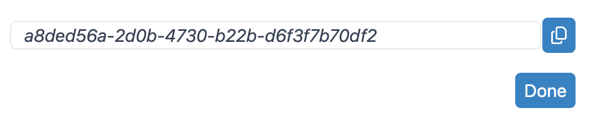
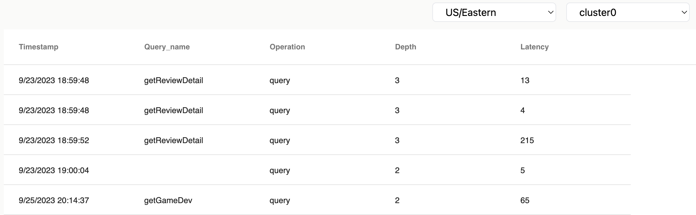
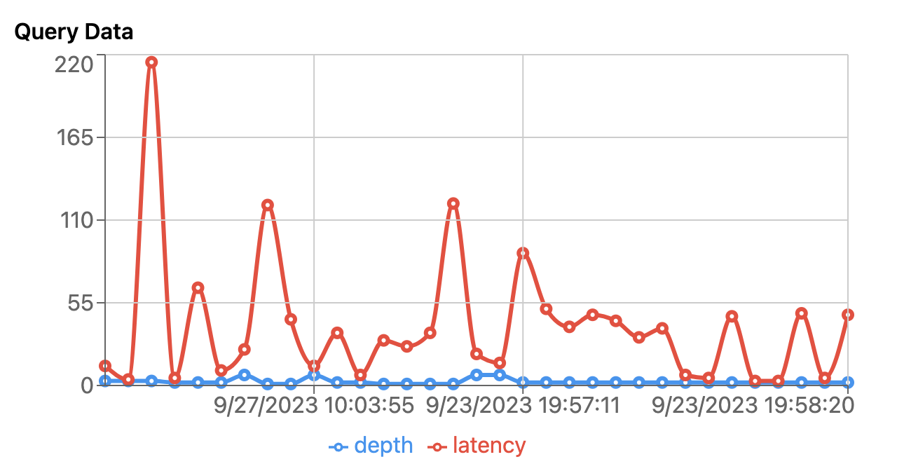

<a name="readme-top"></a>

<!-- PROJECT SHIELDS -->
<!--
*** I'm using markdown "reference style" links for readability.
*** Reference links are enclosed in brackets [ ] instead of parentheses ( ).
*** See the bottom of this document for the declaration of the reference variables
*** for contributors-url, forks-url, etc. This is an optional, concise syntax you may use.
*** https://www.markdownguide.org/basic-syntax/#reference-style-links
-->

[![Contributors][contributors-shield]][contributors-url]
[![Forks][forks-shield]][forks-url]
[![Stargazers][stars-shield]][stars-url]
[![Issues][issues-shield]][issues-url]
[![MIT License][license-shield]][license-url]
[![LinkedIn][linkedin-shield]][linkedin-url]

<!-- PROJECT LOGO -->
<br />
<div align="center">
  <a href="https://github.com/oslabs-beta/Ciphyr">
    
  </a>

  <h3 align="center"> A comprehensive solution for GraphQL traffic monitoring</h3>

  <p align="center">
    Seamlessly integrate within your application today!
    <br />
    <a href="https://github.com/oslabs-beta/Ciphyr"><strong>Explore the docs »</strong></a>
    <br />
    <br />
    <a href="http://www.ciphyr.io">Our Splash</a>
    ·
    <a href="https://github.com/oslabs-beta/Ciphyr/issues">Report Bug</a>
    ·
    <a href="https://github.com/oslabs-beta/Ciphyr/issues">Request Feature</a>
  </p>
</div>

<!-- TABLE OF CONTENTS -->
<details>
  <summary>Table of Contents</summary>
  <ol>
    <li>
      <a href="#about-the-project">About The Product</a>
      <ul>
        <li><a href="#built-with">Built With</a></li>
      </ul>
    </li>
    <li>
      <a href="#getting-started">Getting Started</a>
      <ul>
        <li><a href="#prerequisites">Prerequisites</a></li>
        <li><a href="#installation">Installation</a></li>
      </ul>
    </li>
    <li><a href="#usage">Usage</a></li>
    <li><a href="#roadmap">Roadmap</a></li>
    <li><a href="#contributing">Contributing</a></li>
    <li><a href="#license">License</a></li>
    <li><a href="#contact">Contact</a></li>
    <li><a href="#acknowledgments">Acknowledgments</a></li>
  </ol>
</details>

<!-- ABOUT THE PROJECT -->

## About The Project

  <br>
    
  <br>
  
Real-time monitoring of your GraphQL server query traffic. Ciphyr takes GraphQL security to the next level. It acts as a vigilant guardian for your GraphQL API, continuously monitoring incoming queries and detecting potential threats. With customizable rules and alerts, you have complete control over what constitutes a security threat. Whether it's identifying complex nested queries or excessive data retrieval, Ciphyr will have your back, notifying you in real time so you can take immediate action.

<p align="right">(<a href="#readme-top">back to top</a>)</p>

### Built With

[![React][React.js]][React-url]
[![Node][Node]][React-url]
[![GraphQL][GraphQL]][React-url]
[![Tailwind][Tailwind]][React-url]
[![PostgreSQL][PostgreSQL]][React-url]
[![Jest][Jest]][React-url]
[![Testing Library][Testing Library]][React-url]
[![Vite][Vite]][React-url]
[![Heroku][Heroku]][React-url]
[![Express][Express]][React-url]
[![Apollo-GraphQL][Apollo-GraphQL]][React-url]

<p align="right">(<a href="#readme-top">back to top</a>)</p>

<!-- GETTING STARTED -->

## Getting Started

Super easy to get started

### Prerequisites

Ciphyr supports Apollo Server V4. Create your GraphQL server with '@apollo/server'.

- Install Apollo Server
  ```sh
  npm install @apollo/server
  ```
- Import Required Module
  ```sh
  import { ApolloServer } from '@apollo/server'
  
  import { startStandaloneServer } from '@apollo/server/standalone'
  ```
<br>
We have a demo-app that you can clone and test Ciphyr with
  <br>
  https://github.com/Ciphyr-OSP4/ciphyr-demo


### Installation

Follow these steps to connect to Ciphyr library and visualizer

  1. Sign up at [Ciphyr Home Page](http://www.ciphyr.io/signup)
     
  2. Sign in to enter home page
     
  3. Create your free instance and save your API key <br>
     
     
     <br>
     
     <br>
     
  5. In your graphQL application, install and import ciphyr
     ```sh
     npm install ciphyr
     ```
     
     ```sh
     import ciphyr from 'ciphyr' || const ciphyr = require('ciphyr')
     ```
  6. Create a variable named API_KEY in your .env file
     ```sh
     API_KEY = <Your_API_Key>
     ```

<p align="right">(<a href="#readme-top">back to top</a>)</p>

<!-- USAGE EXAMPLES -->

## Usage

- Now you can use Ciphyr! To access all the functions, simply place 'ciphyr.myPlugin' inside your Apollo server.
  ```sh
  const server = new ApolloServer({
    typeDefs,
    resolvers,
    plugins: [<Your Plugins>..., ciphyr.myPlugin]
  })
  ```
- Try sending some queries to your GraphQL server. The query logs will pop up in your dashboard! <br>
   <br>
- Visualized graph for insignts of your query logs. <br>
   <br>
  <br>
_For more examples, please refer to the [Documentation](https://github.com/oslabs-beta/Ciphyr)_

<p align="right">(<a href="#readme-top">back to top</a>)</p>

<!-- ROADMAP -->

## Roadmap

- [x] V.1 npm package
- [x] V.1 Visualizer
- [ ] Multi-server support
- [ ] Rate limiting and throttling
- [ ] Alert expansion

See the [open issues](https://github.com/oslabs-beta/Ciphyr/issues) for a full list of proposed features (and known issues).

<p align="right">(<a href="#readme-top">back to top</a>)</p>

<!-- CONTRIBUTING -->

## Contributing

Contributions are what make the open source community such an amazing place to learn, inspire, and create. Any contributions you make are **greatly appreciated**.

If you have a suggestion that would make this better, please fork the repo and create a pull request. You can also simply open an issue with the tag "enhancement".
Don't forget to give the project a star! Thanks again!

1. Fork the Project
2. Create your Feature Branch (`git checkout -b feature/AmazingFeature`)
3. Commit your Changes (`git commit -m 'Add some AmazingFeature'`)
4. Push to the Branch (`git push origin feature/AmazingFeature`)
5. Open a Pull Request

<p align="right">(<a href="#readme-top">back to top</a>)</p>

<!-- LICENSE -->

## License

Distributed under the MIT License. See `LICENSE.txt` for more information.

<p align="right">(<a href="#readme-top">back to top</a>)</p>

<!-- CONTACT -->

## Contact

Ciphyr - @ciphyr.io

Project Link: [https://github.com/oslabs-beta/Ciphyr](https://github.com/oslabs-beta/Ciphyr)

<p align="right">(<a href="#readme-top">back to top</a>)</p>

<!-- ACKNOWLEDGMENTS -->

## Acknowledgments

- [CSS by Tailwind](https://tailwindcss.com)

<p align="right">(<a href="#readme-top">back to top</a>)</p>

<!-- MARKDOWN LINKS & IMAGES -->
<!-- https://www.markdownguide.org/basic-syntax/#reference-style-links -->

[contributors-shield]: https://img.shields.io/github/contributors/oslabs-beta/Ciphyr.svg?style=for-the-badge
[contributors-url]: https://github.com/oslabs-beta/Ciphyr/graphs/contributors
[forks-shield]: https://img.shields.io/github/forks/oslabs-beta/Ciphyr.svg?style=for-the-badge
[forks-url]: https://github.com/oslabs-beta/Ciphyr/network/members
[stars-shield]: https://img.shields.io/github/stars/oslabs-beta/Ciphyr.svg?style=for-the-badge
[stars-url]: https://github.com/oslabs-beta/Ciphyr/stargazers
[issues-shield]: https://img.shields.io/github/issues/oslabs-beta/Ciphyr.svg?style=for-the-badge
[issues-url]: https://github.com/oslabs-beta/Ciphyr/issues
[license-shield]: https://img.shields.io/github/license/oslabs-beta/Ciphyr.svg?style=for-the-badge
[license-url]: https://github.com/oslabs-beta/Ciphyr/blob/LICENSE
[linkedin-shield]: https://img.shields.io/badge/-LinkedIn-black.svg?style=for-the-badge&logo=linkedin&colorB=555
[linkedin-url]: https://www.linkedin.com/company/ciphyr/
[product-screenshot]: images/screenshot.png
[React.js]: https://img.shields.io/badge/React-20232A?style=for-the-badge&logo=react&logoColor=61DAFB
[React-url]: https://reactjs.org/
[TypeScript]: https://img.shields.io/badge/TypeScript-007ACC?style=for-the-badge&logo=typescript&logoColor=white
[JavaScript]: https://img.shields.io/badge/javascript-%23323330.svg?style=for-the-badge&logo=javascript&logoColor=%23F7DF1E
[React]: https://img.shields.io/badge/react-%2320232a.svg?style=for-the-badge&logo=react&logoColor=%2361DAFB
[Node]: https://img.shields.io/badge/-node-339933?style=for-the-badge&logo=node.js&logoColor=white
[Express]: https://img.shields.io/badge/Express.js-404D59?style=for-the-badge
[PostgreSQL]: https://img.shields.io/badge/PostgreSQL-4EA94B?style=for-the-badge&logo=postgres&logoColor=white
[Tailwind]: https://img.shields.io/badge/Tailwind_CSS-38B2AC?style=for-the-badge&logo=tailwind-css&logoColor=white
[Jest]: https://img.shields.io/badge/Jest-323330?style=for-the-badge&logo=Jest&logoColor=white
[Testing Library]: https://img.shields.io/badge/testing%20library-323330?style=for-the-badge&logo=testing-librarylogoColor=red
[Vite]: https://img.shields.io/badge/vite-%23646CFF.svg?style=for-the-badge&logo=vite&logoColor=white
[Docker]: https://img.shields.io/badge/docker-%230db7ed.svg?style=for-the-badge&logo=docker&logoColor=white
[Chart.js]: https://img.shields.io/badge/chart.js-F5788D.svg?style=for-the-badge&logo=chart.js&logoColor=white
[AWS]: https://img.shields.io/badge/AWS-%23FF9900.svg?style=for-the-badge&logo=amazon-aws&logoColor=white
[Heroku]: https://img.shields.io/badge/Heroku-430098?style=for-the-badge&logo=heroku&logoColor=white
[Apollo-GraphQL]: https://img.shields.io/badge/-ApolloGraphQL-311C87?style=for-the-badge&logo=apollo-graphql
[GraphQL]: https://img.shields.io/badge/-GraphQL-E10098?style=for-the-badge&logo=graphql&logoColor=white
[HTML5]: https://img.shields.io/badge/html5-%23E34F26.svg?style=for-the-badge&logo=html5&logoColor=white
